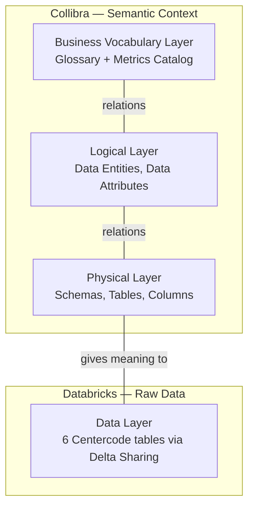

# Ask Your Data Hackathon

Starter pack for building **"Ask Your Data Product"** — a system that answers business questions from data by grounding itself in governed semantic context (Collibra) and executing against real data (Databricks).

Read the full case and challenge rules in `[docs/hackathon-briefing.docx.md](docs/hackathon-briefing.docx.md)`.

---

## Quick start

**1. Create a virtual environment and install dependencies**

```bash
python3 -m venv .venv
source .venv/bin/activate
pip install -r requirements.txt
```

**2. Configure environment variables**

```bash
cp .env.example .env
```

Open `.env` and fill in the credentials distributed at kickoff:


| Variable                | What to set                                                          |
| ----------------------- | -------------------------------------------------------------------- |
| `COLLIBRA_BASE_URL`     | Pre-filled: `https://next.collibra.com`                              |
| `COLLIBRA_USERNAME`     | Your Collibra username (from organizers)                             |
| `COLLIBRA_PASSWORD`     | Your Collibra password (from organizers)                             |
| `DELTA_SHARING_PROFILE` | Pre-filled: `config.json` (from organizers)                          |
| `DELTA_SHARING_LIMIT`   | Number of rows per table load (default `1000`, set `0` for all rows) |


**3. Verify connectivity**

```bash
# Collibra — should return JSON with domain metadata
curl -u "$COLLIBRA_USERNAME:$COLLIBRA_PASSWORD" \
  "https://next.collibra.com/rest/2.0/domains/019c907a-40d8-74d9-84c5-83abd6ae4d4e"
```

Expected output:

```json
{"id":"019c907a-40d8-74d9-84c5-83abd6ae4d4e","createdBy":"019c8fd6-a4b3-719a-ba6d-687d66eedd4d","createdOn":1771950457051,"lastModifiedBy":"019c8fd6-a4b3-719a-ba6d-687d66eedd4d","lastModifiedOn":1772462887078,"system":false,"resourceType":"Domain","name":"Centercode Glossary","description":"List of all the Business terms used for the Centercode use case","type":{"id":"00000000-0000-0000-0000-000000010001","resourceType":"DomainType","resourceDiscriminator":"DomainType","name":"Glossary"},"community":{"id":"019c907a-40b6-7614-a3f0-22a9bcef737f","resourceType":"Community","resourceDiscriminator":"Community","name":"Next Level Challenge"},"excludedFromAutoHyperlinking":true}
```

```bash
# Delta Sharing — list all available tables
python3 -c "import delta_sharing; client = delta_sharing.SharingClient('config.json'); print(client.list_all_tables())"
```

Expected output:

```
[Table(name='zcc_prt_mtrc', share='centercode_share', schema='centercode'), Table(name='zcc_qa_sat', share='centercode_share', schema='centercode'), Table(name='zcc_ptm_lnk', share='centercode_share', schema='centercode'), Table(name='zcc_tkt_itm', share='centercode_share', schema='centercode'), Table(name='zcc_act_stat', share='centercode_share', schema='centercode'), Table(name='zcc_prj_hdr', share='centercode_share', schema='centercode')]
```

---

## What's in this repo

```
.
├── docs/
│   ├── hackathon-briefing.docx.md   # The case: what you're building and why
│   ├── collibra_api_guide.md        # Collibra REST API guide (layers, endpoints, patterns)
│   └── delta_sharing_guide.md       # Delta Sharing guide (connecting to Databricks data)
├── config.json                      # Delta Sharing profile (bearer token — treat as secret)
├── .env.example                     # Environment variable template
├── requirements.txt                 # Python dependencies
└── README.md                        # You are here
```

---

## Architecture overview

The hackathon data lives in two systems. **Collibra** holds the semantic context (what things mean), and **Databricks** holds the raw data (the actual tables you query). Your job is to connect these systems and ingest the unified data into your LLM-based system.




**How to read this:** Business terms (like "Active Tester") are defined in the Business Vocabulary layer. The Logical layer maps those terms to abstract data concepts. The Physical layer describes the actual database columns. The Data layer is where the raw rows live. Relations in Collibra connect these layers together.

---

## Layer reference

Each layer lives in a Collibra **domain** (or in Databricks for the data layer). You will need these domain IDs to query the API.


| Layer    | Domain                     | Domain ID                              | What you'll find                                                                 |
| -------- | -------------------------- | -------------------------------------- | -------------------------------------------------------------------------------- |
| Business | Glossary                   | `019c907a-40d8-74d9-84c5-83abd6ae4d4e` | Business terms with governed definitions and synonyms                            |
| Business | Metrics Catalog            | `019c9f76-2a44-7242-8f7d-cf40e16f270b` | Metric definitions and calculation rules                                         |
| Logical  | Logical Layer              | `019c9e6d-9079-72e3-b0f9-e64c49a57ac9` | Data Entities and Data Attributes that bridge business terms to physical columns |
| Physical | Physical Data Layer        | `019c9e17-b6f2-725e-9181-dbda44044df9` | Schemas, tables, and columns with plain-English descriptions                     |
| Data     | Databricks (Delta Sharing) | —                                      | 6 Centercode tables accessed via `config.json`                                   |


For details on how to query each layer, see the guides below.

---

## Guides

| Guide | What it covers |
|---|---|
| [Collibra API Guide](docs/collibra_api_guide.md) | How Collibra is structured, how to authenticate, how to query each layer, how to navigate relations between layers |
| [Delta Sharing Guide](docs/delta_sharing_guide.md) | How to connect to Databricks, load the six hackathon tables, and explore the raw data |
| [Hackathon Briefing](docs/hackathon-briefing.md) | Overview of the hackathon goals, datasets, and tasks. Start here if you're new to the project. |

---

## Useful links


| Resource                      | URL                                                                                                                |
| ----------------------------- | ------------------------------------------------------------------------------------------------------------------ |
| Collibra instance (UI)        | [https://next.collibra.com](https://next.collibra.com)                                                             |
| Collibra REST API docs        | [https://developer.collibra.com/api/rest/data-governance](https://developer.collibra.com/api/rest/data-governance) |
| Delta Sharing specification   | [https://github.com/delta-io/delta-sharing](https://github.com/delta-io/delta-sharing)                             |
| Databricks Delta Sharing docs | [https://docs.databricks.com/en/delta-sharing/index.html](https://docs.databricks.com/en/delta-sharing/index.html) |


---

## Security

- `**.env`** contains Collibra credentials. Never commit it. Use `.env.example` as the shareable template.
- `**config.json**` contains the Delta Sharing bearer token. Treat it like a password. Never paste it in public channels.
- Both files are listed in `.gitignore`.

