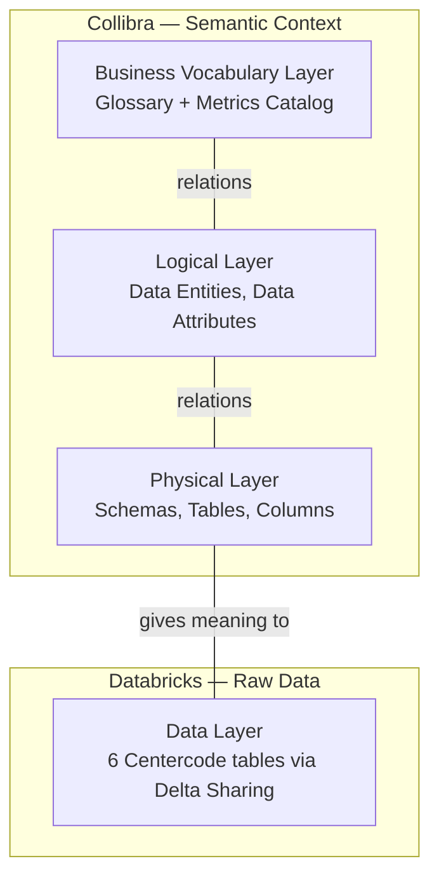

# Collibra REST API Guide

This guide explains how Collibra is structured, how to connect to it, and how to query each layer of the semantic model. By the end you will know where every piece of context lives and how to retrieve it.

**Official API docs:** [https://developer.collibra.com/api/rest/data-governance](https://developer.collibra.com/api/rest/data-governance)
**Full OpenAPI spec:** `[rest_api_collibra.json](rest_api_collibra.json)` — import into Postman or Insomnia to explore all endpoints interactively.

---

## 1. What is Collibra?

Collibra is a data intelligence platform. Organizations use it to document what their data means, who owns it, and how it should be used. Think of it as a structured knowledge base for data: every table, column, business term, and metric can have a governed definition, a description, and explicit links to related assets.

For this hackathon, a Collibra instance has been pre-populated with the semantic context for the Centercode dataset. Your goal is to retrieve that context via the REST API and use it to make your system answer business questions accurately.

---

## 2. The architecture: four layers

The hackathon data spans two systems and four layers. **Collibra** holds three layers of semantic context. **Databricks** holds the raw data.




### What each layer contains


| Layer    | Domain              | Domain ID                              | What you'll find                                                                                             |
| -------- | ------------------- | -------------------------------------- | ------------------------------------------------------------------------------------------------------------ |
| Business | Glossary            | `019c907a-40d8-74d9-84c5-83abd6ae4d4e` | Business terms (e.g. "Active Tester", "Feedback Impact Score") with governed definitions and synonyms        |
| Business | Metrics Catalog     | `019c9f76-2a44-7242-8f7d-cf40e16f270b` | Measure definitions and calculation rules                                                                    |
| Logical  | Logical Layer       | `019c9e6d-9079-72e3-b0f9-e64c49a57ac9` | Data Entities and Data Attributes — abstract concepts that bridge business terms to physical columns         |
| Physical | Physical Data Layer | `019c9e17-b6f2-725e-9181-dbda44044df9` | Schemas, tables, and columns with plain-English descriptions (e.g. `Z_ENG_ST` = "Current engagement status") |


**Why four layers?** A business user asks about "Active Testers." The Business Vocabulary layer defines exactly what that means. The Logical layer maps that concept to an abstract data attribute. The Physical layer tells you which actual database column (`Z_ENG_ST` in table `zcc_act_stat`) stores the value. Without all three, an AI has to guess which column to query — and it will often guess wrong.

---

## 3. Getting started

### Base URL

All API requests go to:

```
https://next.collibra.com/rest/2.0/{endpoint}
```

### Authentication

The API uses **HTTP Basic Auth**. Pass your Collibra username and password on every request.

**curl example:**

```bash
curl -u "your_username:your_password" \
  -H "Accept: application/json" \
  "https://next.collibra.com/rest/2.0/domains/019c907a-40d8-74d9-84c5-83abd6ae4d4e"
```

**Python example:**

```python
import os
import requests
from dotenv import load_dotenv

load_dotenv()

BASE_URL = os.getenv("COLLIBRA_BASE_URL", "https://next.collibra.com")
API_ROOT = f"{BASE_URL}/rest/2.0"

session = requests.Session()
session.auth = (os.getenv("COLLIBRA_USERNAME"), os.getenv("COLLIBRA_PASSWORD"))
session.headers.update({"Accept": "application/json"})

# Test: fetch domain metadata
resp = session.get(f"{API_ROOT}/domains/019c907a-40d8-74d9-84c5-83abd6ae4d4e")
print(resp.json()["name"])  # Should print the Glossary domain name
```

---

## 4. Core API patterns

These are the building blocks. Every interaction with Collibra is a combination of these patterns.

### Pattern 1: Verify a domain

The simplest call. Confirms connectivity and returns metadata about a domain.

```
GET /domains/{domainId}
```

**Example:** `GET /domains/019c907a-40d8-74d9-84c5-83abd6ae4d4e`

**Key fields in the response:**


| Field            | Description                                               |
| ---------------- | --------------------------------------------------------- |
| `id`             | Domain UUID                                               |
| `name`           | Human-readable domain name                                |
| `type.name`      | Domain type (e.g. `Glossary`, `Physical Data Dictionary`) |
| `community.name` | Parent community name                                     |


---

### Pattern 2: Discover asset types in a domain

Collibra organizes content into **assets**, and each asset has a **type** (e.g. Business Term, Column, Table, Data Entity). Asset type IDs are instance-specific — you cannot hardcode them. Use this endpoint to discover what types exist in a domain.

```
GET /assignments/domain/{domainId}/assetTypes
```

**Example:** `GET /assignments/domain/019c9e17-b6f2-725e-9181-dbda44044df9/assetTypes`

Returns a list of objects like:

```json
{ "id": "...", "name": "Column", "description": "...", "parent": { "id": "...", "name": "..." } }
```

This tells you what kind of assets live in the domain (Column, Table, Schema, etc.) and gives you the type IDs you need to filter by type in subsequent queries.

---

### Pattern 3: List assets in a domain

The main enumeration endpoint. Returns all assets in a domain, optionally filtered by type.

```
GET /assets?domainId={domainId}
```

**Useful parameters:**


| Parameter         | Example   | Description                                      |
| ----------------- | --------- | ------------------------------------------------ |
| `domainId`        | UUID      | Filter to assets in this domain                  |
| `typeId`          | UUID      | Filter to a specific asset type (from Pattern 2) |
| `sortField`       | `NAME`    | Sort results                                     |
| `sortOrder`       | `ASC`     | `ASC` or `DESC`                                  |
| `excludeMeta`     | `true`    | Exclude internal Collibra meta-assets            |
| `typeInheritance` | `true`    | Include assets of subtypes                       |
| `limit`           | `1000`    | Page size                                        |
| `cursor`          | `<token>` | For pagination (see below)                       |


**Key fields in each result:**


| Field         | Description                                                                                     |
| ------------- | ----------------------------------------------------------------------------------------------- |
| `id`          | Asset UUID — you'll use this to fetch attributes and relations                                  |
| `displayName` | Human-readable name (prefer over `name` for display)                                            |
| `type.name`   | Asset type: `Business Term`, `Column`, `Table`, `Schema`, `Data Entity`, `Data Attribute`, etc. |
| `status.name` | Governance status: `Candidate`, `Accepted`, etc.                                                |
| `domain.id`   | Which domain this asset belongs to                                                              |


**Example response shape:**

```json
{
  "total": 49,
  "limit": 1000,
  "nextCursor": "",
  "results": [
    {
      "id": "0198c234-11fe-73ff-be9b-c91312850031",
      "name": "Active Tester",
      "displayName": "Active Tester",
      "type": { "name": "Business Term" },
      "status": { "name": "Accepted" },
      "domain": { "id": "019c907a-40d8-74d9-84c5-83abd6ae4d4e", "name": "..." }
    }
  ]
}
```

---

### Pattern 4: Get attributes for an asset

In Collibra, human-readable metadata is stored as **attributes** — separate from the asset record. An asset's definition, description, synonyms, notes, and examples are all attributes.

```
GET /attributes?assetId={assetId}
```

**Useful parameters:**


| Parameter   | Example         | Description                      |
| ----------- | --------------- | -------------------------------- |
| `assetId`   | UUID            | Return attributes for this asset |
| `sortField` | `LAST_MODIFIED` | Sort field                       |
| `sortOrder` | `DESC`          | Sort direction                   |
| `limit`     | `1000`          | Page size                        |


**Key fields in each result:**


| Field       | Description                                                               |
| ----------- | ------------------------------------------------------------------------- |
| `type.name` | Attribute type: `Definition`, `Description`, `Note`, `Synonym`, `Example` |
| `value`     | The text content                                                          |


**Important:** The `value` field may contain HTML markup (bold, lists, etc.). Strip HTML tags before injecting into LLM prompts or doing text comparisons.

**Example:** To get the governed definition of "Active Tester," first find its asset ID from Pattern 3, then call `GET /attributes?assetId={id}` and look for the attribute where `type.name` is `"Definition"`.

---

### Pattern 5: Get relations for an asset

Relations are the edges in Collibra's semantic graph. They connect assets across layers — for example, linking a business term to a logical attribute, or a logical attribute to a physical column.

```
GET /relations?sourceId={assetId}    # outbound relations (this asset points to others)
GET /relations?targetId={assetId}    # inbound relations (others point to this asset)
```

You can pass `sourceId`, `targetId`, or both.

**Key fields in each result:**


| Field                                     | Description                                  |
| ----------------------------------------- | -------------------------------------------- |
| `source.id` / `source.name`               | The asset on the "from" side of the relation |
| `target.id` / `target.name`               | The asset on the "to" side of the relation   |
| `source.domain.id` / `source.domain.name` | Domain of the source asset                   |
| `target.domain.id` / `target.domain.name` | Domain of the target asset                   |
| `type.name`                               | Relation type label                          |


**Example response shape:**

```json
{
  "total": 2,
  "results": [
    {
      "id": "...",
      "type": { "name": "<no relation type name>" },
      "source": {
        "id": "...", "name": "Active Tester",
        "domain": { "id": "019c907a-...", "name": "Glossary" }
      },
      "target": {
        "id": "...", "name": "active_tester",
        "domain": { "id": "019c9e6d-...", "name": "Logical Layer" }
      }
    }
  ]
}
```

**How to determine what a relation means:** The `type.name` field will often read `"<no relation type name>"` — this is expected, not a bug. Instead, look at `source.domain.name` and `target.domain.name` to understand which layers the relation connects. A relation from the Glossary domain to the Logical Layer domain means "this business term is expressed by this logical asset."

---

### Pagination

Most list endpoints return paginated results. Two styles exist:


| Style                       | How it works                                                                                                       |
| --------------------------- | ------------------------------------------------------------------------------------------------------------------ |
| **Cursor** (preferred)      | Response includes `nextCursor`. Pass `cursor=<value>` on the next request. Stop when `nextCursor` is empty (`""`). |
| **Offset/limit** (fallback) | Response includes `total`. Increment `offset` by `limit` until `offset >= total` or results are empty.             |


Set `limit=1000` for large fetches. Always check whether there are more pages — some domains have hundreds of assets.

---

## 5. Layer-by-layer: what to query and why

### Business Vocabulary Layer

**Domains:** Glossary (`019c907a-40d8-74d9-84c5-83abd6ae4d4e`) and Metrics Catalog (`019c9f76-2a44-7242-8f7d-cf40e16f270b`)

**What lives here:** Business Terms and Measures — the governed definitions that tell you what business concepts actually mean. For example, "Active Tester" is not just anyone who logged in. It has a precise definition involving activity completion thresholds, survey submissions, and feedback ticket counts. That definition lives here as an attribute.

**What to query:**

1. `GET /assets?domainId=019c907a-40d8-74d9-84c5-83abd6ae4d4e` — lists all Business Terms in the Glossary (~49 terms)
2. For each term, `GET /attributes?assetId={termId}` — returns the governed `Definition`, `Description`, `Synonym`, and other text attributes
3. Optionally, `GET /relations?sourceId={termId}` — shows what other assets this term relates to (which logical assets, which other terms)

**What you get:** A vocabulary of business concepts with their exact definitions — the foundation your system needs to understand what a user is actually asking about.

---

### Physical Data Layer

**Domain:** Physical Data Layer (`019c9e17-b6f2-725e-9181-dbda44044df9`)

**What lives here:** The physical schema of the Databricks tables — Schemas, Tables, and Columns, each with plain-English descriptions. The column names in Databricks are cryptic on purpose (`Z_ENG_ST`, `Z_IMP_SC`, `Z_OCC_MNG`). The descriptions that explain what each column actually stores live here.

**What to query:**

1. `GET /assignments/domain/019c9e17-b6f2-725e-9181-dbda44044df9/assetTypes` — discover the type IDs for Schema, Table, and Column in this instance
2. `GET /assets?domainId=019c9e17-b6f2-725e-9181-dbda44044df9` — lists all physical assets (schemas, tables, columns mixed together). Use the type IDs from step 1 to separate them.
3. For each asset, `GET /attributes?assetId={assetId}` — returns the `Description` that explains what the column/table contains

**Reconstructing the hierarchy (Schema -> Table -> Column):**

The API returns all physical assets as a flat list. To know which columns belong to which table (and which tables belong to which schema), you query relations:

- `GET /relations?sourceId={schemaId}` — outbound relations from a schema to its tables
- `GET /relations?sourceId={tableId}` — outbound relations from a table to its columns

The relation direction can vary by Collibra configuration, so query both `sourceId` and `targetId` and infer the hierarchy from the asset types on each side. If one side is a Table and the other is a Column, the Table is the parent.

**What you get:** A complete data dictionary — every column in every table, with a human-readable description of what it stores.

---

### Logical Layer (the semantic bridge)

The logical layer is the **semantic representation** of the physical layer. Each logical concept maps directly to its physical counterpart:


| Physical Layer | Logical Layer   |
| -------------- | --------------- |
| Schema         | Data Model      |
| Tables         | Data Entities   |
| Columns        | Data Attributes |


While the physical layer describes *how data is stored*, the logical layer describes *what the data means* — using governed, business-friendly names and definitions that are independent of any specific database or table structure.

**Domain:** Logical Layer (`019c9e6d-9079-72e3-b0f9-e64c49a57ac9`)

**What lives here:** Data Model -> Data Entities -> Data Attributes — abstract concepts that serve as the bridge between business terms and physical columns. This is the most important layer for building a reliable system, because it provides the governed mapping from "what the user asked" to "which column to query."

**The two-hop pattern:**

```
Business Term  ──(relation)──>  Logical Asset  ──(relation)──>  Physical Column
   (Glossary)                  (Logical Layer)                 (Physical Data Layer)
```

To trace the full path from a business term to a physical column, you need two sets of relations:

**Hop 1 — Business Terms to Logical Assets (inbound relations):**

For each logical asset, query `GET /relations?targetId={logicalAssetId}`. This returns inbound relations — other assets pointing at this logical asset. Filter results where `source.domain.id` matches the Glossary domain to find which Business Terms map to this logical asset.

**Hop 2 — Logical Assets to Physical Columns (outbound relations):**

For each logical asset, query `GET /relations?sourceId={logicalAssetId}`. This returns outbound relations — assets this logical asset points to. Filter results where `target.domain.id` matches the Physical Data Layer domain to find which physical columns this logical asset maps to.

**Putting it together:**

By combining these two hops, you get a governed chain:

> "Active Tester" (Business Term) -> `active_tester` (Logical Attribute) -> `Z_ENG_ST` in `zcc_act_stat` (Physical Column)

This chain tells your system exactly which column to use when answering a question about "active testers" — no guessing required.

**What to query:**

1. `GET /assets?domainId=019c9e6d-9079-72e3-b0f9-e64c49a57ac9` — lists all logical assets (~46 assets: Data Models, Data Entities, Data Attributes)
2. For each logical asset:
  - `GET /relations?targetId={logicalAssetId}` — inbound: which Business Terms point here
  - `GET /relations?sourceId={logicalAssetId}` — outbound: which Physical Columns this maps to
3. Optionally, `GET /attributes?assetId={logicalAssetId}` — descriptions and definitions of the logical assets themselves

---

## 6. Gotchas and tips

**Relation type names are often missing.** The `type.name` field on relations frequently reads `"<no relation type name>"`. This is normal. Do not rely on this field to determine what a relation means. Instead, use `source.domain.name` and `target.domain.name` — the domain names tell you exactly which layers are connected.

**Attribute values may contain HTML.** Some definitions and descriptions contain HTML markup (bold, lists, links). Strip HTML tags before using the text as context for an LLM.

**Asset type IDs are instance-specific.** The ID for "Column" or "Business Term" is different on every Collibra instance. Always call `GET /assignments/domain/{domainId}/assetTypes` to discover the correct IDs. Never hardcode them.

**Rate limiting.** If you hit `429 Too Many Requests` errors, add a small delay (e.g. 200ms) between API calls. This is especially relevant when fetching attributes or relations for many assets in a loop.

`**displayName` vs `name`.** Prefer `displayName` for human-readable output. The `name` field is the internal identifier and may differ.

---

## 7. Error handling


| HTTP status                 | Likely cause                                                   |
| --------------------------- | -------------------------------------------------------------- |
| `401 Unauthorized`          | Wrong `COLLIBRA_USERNAME` or `COLLIBRA_PASSWORD` in `.env`     |
| `403 Forbidden`             | Your account does not have permission for this domain or asset |
| `404 Not Found`             | The domain ID or asset ID does not exist on this instance      |
| `429 Too Many Requests`     | Rate limit hit — add a delay between calls                     |
| `500 Internal Server Error` | Instance-side error — wait a moment and retry                  |


---

## 8. Endpoint quick reference


| Endpoint                                    | Method      | Returns                                                       |
| ------------------------------------------- | ----------- | ------------------------------------------------------------- |
| `/domains/{domainId}`                       | GET         | Domain metadata                                               |
| `/assets`                                   | GET (paged) | Assets filtered by domain/type                                |
| `/assets/{assetId}`                         | GET         | Full detail of one asset                                      |
| `/assignments/domain/{domainId}/assetTypes` | GET         | Asset types assignable in a domain                            |
| `/attributes`                               | GET (paged) | Attributes (definitions, descriptions, synonyms) for an asset |
| `/relations`                                | GET (paged) | Relations between assets (the semantic graph)                 |


